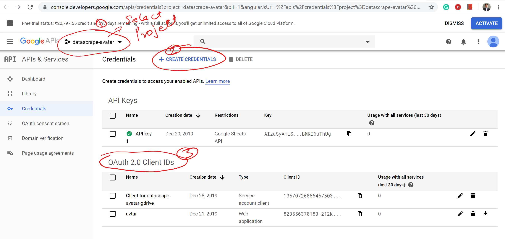

# Crowdsource Editor with Google Sheets

## Get a Google client_id and client_secret
1. Go to URL: https://console.developers.google.com/apis/credentials
2. Create a Project  
3. Follow below screenshot  
  

## Install Locally

1. Install Python 3.7.
2. From root directory run commands.
```
python3 -m venv env
pip install -r requirements.txt
```
3. Update client_id and client_secret from google app in `app.py`.
4. Run/Server python app.
```
cd app
python3 app.py
```

#### Progress:
 - [x] Login/Logout with google.
 - [X] Store login details in sqlitedb,  To be changed later
 - [ ] Firebase implementation : TBD
 - [x] Show/Hide edit menu on Login/Logout
 - [ ] Edit form
