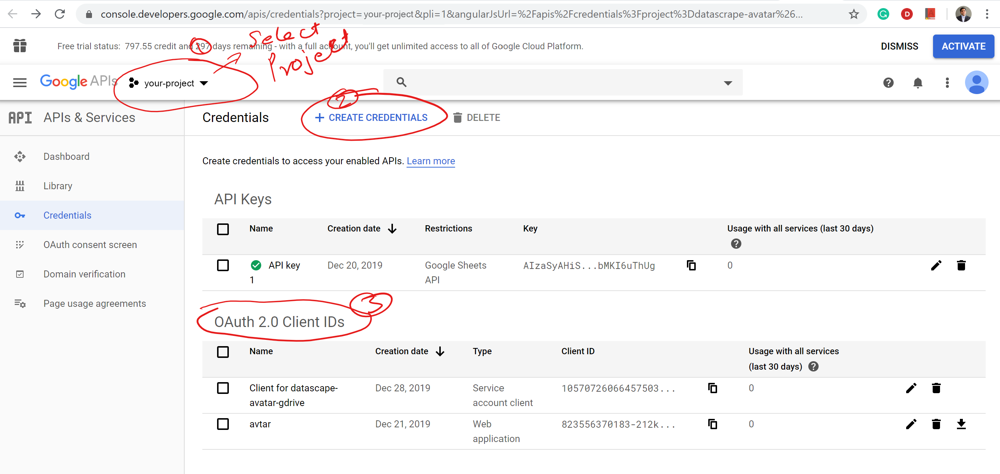

# Crowdsource Editor with Google Sheets

## Get a Google client\_id and client\_secret
1. Go to: [https://console.developers.google.com/apis/credentials](https://console.developers.google.com/apis/credentials)
2. Create a project or choose an existing project
3. Follow the steps in the screenshot below to get your Auth IDs.  
 

  

4. Make note of your GOOGLE\_CLIENT\_ID and GOOGLE\_CLIENT\_SECRET.  

---
[Run Setup](../)

